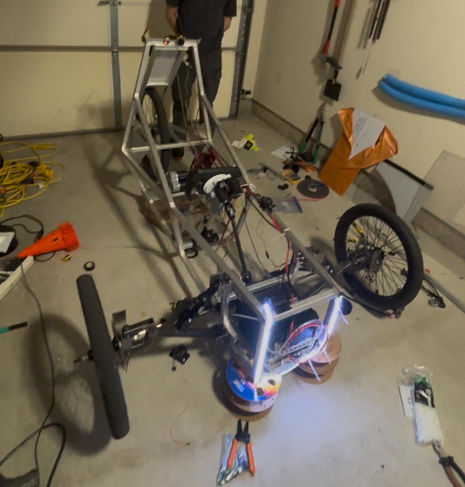
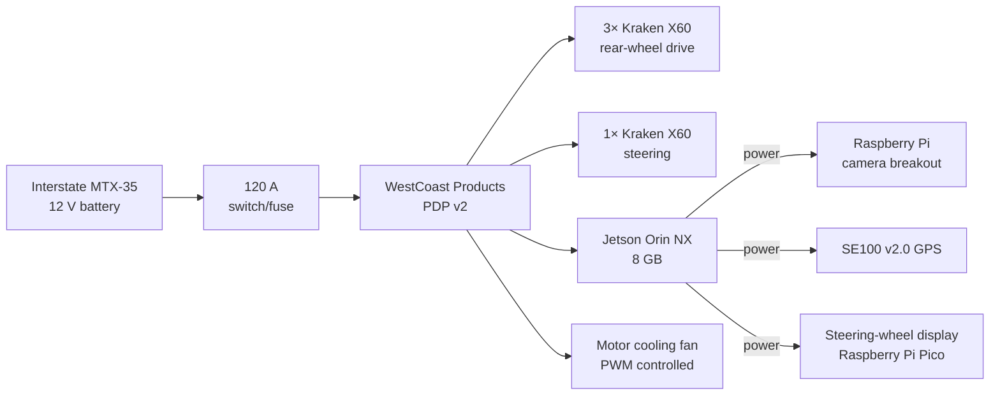
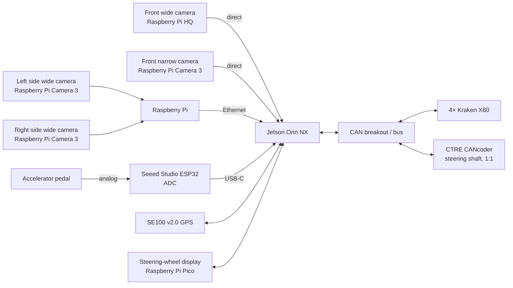
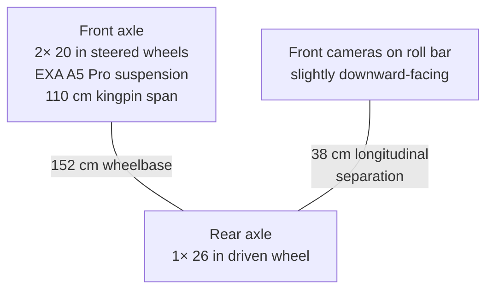
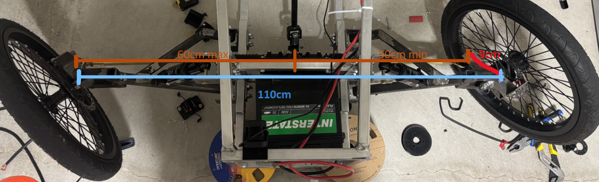
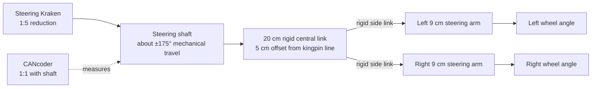

# Vehicle hardware reference

This file records the car **as currently described** so control and autonomy code does not invent hardware assumptions. It is a hardware reference, not a safety case: verify wiring, actuator limits, steering zero/sign, and sensor calibration on the vehicle before commanding motion.

## At a glance

- Three-wheel layout: one driven rear wheel and two steered front wheels.
- Compute: NVIDIA Jetson Orin NX 8 GB.
- Actuation: four Kraken X60s—three for propulsion and one for steering.
- Main supply: Interstate MTX-35 12 V battery through a 120 A switch/fuse and WestCoast Products PDP v2.
- Mechanical CAD: [Onshape vehicle model](https://cad.onshape.com/documents/52e6baf654a7eb8018ef5191/w/2c72d87a029869f997f04ff6/e/ecf9453e586affb1903a958c?renderMode=0&uiState=6a8508e0161e1c59dbad16f5)



*Current vehicle build.*

## Electrical and compute

### Power distribution



The fan's PWM control source is not yet recorded; only its PDP power source and PWM control method are known.

### Data and control connections



The Jetson both powers and communicates with the Raspberry Pi, GPS, and display Pico. The two side cameras reach the Jetson through the Raspberry Pi; the two front cameras connect directly.

## Drivetrain and chassis



- The wheel bottoms are approximately level relative to the frame despite the different diameters.
- The three propulsion Krakens drive the single rear wheel through two reductions:

  `12:60 internal stage × 24:55 chain stage = 11.46:1 total reduction`.
- The steering Kraken uses a reported `1:5` reduction.
- The roll-bar camera position is 38 cm longitudinally from the rear axle. The direction of that offset and the camera optical pose are not yet recorded precisely.

## Steering geometry



*Front steering linkage viewed from above, with its key dimensions labelled.*



Top-view dimensions used for Ackermann calculations:

```text
                         fixed kingpin-to-kingpin span = 110 cm
             left kingpin ●--------------------------------● right kingpin
                           |                                |
                    9 cm rigid arm                   9 cm rigid arm
                           |                                |
                           o--- side link ---[10 cm--M--10 cm]--- side link ---o
                                               ↔
                                  M translates laterally ±5 cm

    Central-link line is parallel to and 5 cm from the kingpin line.
    At center:       kingpin-to-M distances = 55 cm / 55 cm
    At either lock:  kingpin-to-M distances = 50 cm / 60 cm (sides swap)
```

- Each 20 in (50.8 cm) front wheel pivots about its kingpin.
- Each rigid 9 cm steering arm is parallel to and rotates with its wheel.
- The central section is rigid, 20 cm long, and extends 10 cm to each side of its midpoint `M`.
- Rigid side links join the central-section ends to the steering-arm pickups.
- The lateral translation creates different inner and outer wheel angles through the linkage geometry.
- `±175°` is approximate steering-shaft travel, **not wheel angle**. Firmware will probably impose a tighter limit; the final zero, sign, usable stops, and shaft-to-link translation must be calibrated on the built car.
