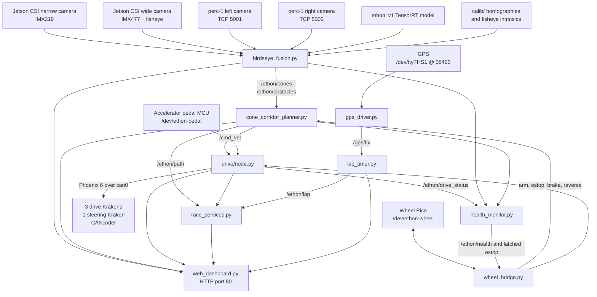

# Ethon firmware and autonomy stack

This document describes the software currently deployed on the Ethon vehicle's
NVIDIA Jetson Orin NX. It complements [CAR.md](CAR.md), which describes the
physical vehicle.

The first repository snapshot was taken from `jetson@192.168.2.162` on
2026-08-22 at approximately 16:37 EDT. The live deployment directory on the
Jetson is `/home/jetson/ethon`; its repository backup is
[`jetson/ethon`](jetson/ethon).

## Backup scope

The repository snapshot includes:

- all top-level Python, shell, YAML, udev, sudoers, systemd, and Markdown files;
- the modular `drive/` package;
- the steering-wheel Pico source and its CircuitPython UF2 image in `pico/`;
- legacy HMI and lighting source in `legacy/`;
- camera calibration matrices, metadata, and reference images in `calib/`;
- every manually named `.bak` source/configuration file found on the Jetson;
- a snapshot of the effective files from `/etc/systemd/system` and
  `/etc/udev/rules.d` in `jetson/ethon/deployed/`.

The live directory is about 38 GB, but almost all of that is generated data.
The following artifacts deliberately remain on the Jetson and are ignored by
Git:

| Remote path | Size at snapshot | Reason not stored in Git |
|---|---:|---|
| `/home/jetson/ethon/capture_data/` | 37 GB / 156,962 files | Training/capture images and labels, not source code |
| `/home/jetson/ethon/models/` | 767 MB | Generated `.pt`, `.onnx`, and TensorRT `.engine` files; some exceed GitHub's file limit |
| `/home/jetson/ethon/logs/` | 19 MB / 52 files | Runtime CSV telemetry |
| `__pycache__/` and `*.pyc` | Generated | Python bytecode caches |

The model filenames and SHA-256 checksums are preserved in
[`jetson/ethon/models/REMOTE_MANIFEST.sha256`](jetson/ethon/models/REMOTE_MANIFEST.sha256).

Two installed root-owned files, `/etc/sudoers.d/ethon-clear-estop` and
`/etc/sudoers.d/ethon-hmi`, could not be downloaded through the unprivileged
SFTP account. A source copy of the HMI policy is present as
`jetson/ethon/ethon-hmi.sudoers`; the exact installed `ethon-clear-estop` policy
is the only identified deployment-configuration gap.

## Runtime platform

| Component | Observed value |
|---|---|
| Compute | NVIDIA Jetson Orin NX 8 GB, ARM64 |
| Jetson Linux | L4T R36.4.7, kernel `5.15.148-tegra` |
| Python | 3.10.12 |
| ROS | ROS 2 Humble, domain ID 42, Cyclone DDS |
| NumPy | 1.26.4 |
| PyYAML | 6.0.3 |
| pyserial | 3.5 |
| Ultralytics | 8.4.26 |
| Phoenix 6 | 26.3.0 |
| PyTorch | `2.5.0a0+872d972e41.nv24.8` |

The runtime is not packaged as a ROS workspace. Most nodes are plain Python
scripts launched from `/home/jetson/ethon` after sourcing ROS Humble.

## System architecture



### Main autonomy pipeline

1. `birdseye_fusion.py` opens two local CSI cameras and two TCP camera feeds
   from the `perc-1` Raspberry Pi. It runs the TensorRT detection model, applies
   each camera's calibration, merges duplicate detections, and publishes cones,
   obstacles, curb points, and fusion status at approximately 10 Hz.
2. `cone_corridor_planner.py` pairs cone walls, builds a corridor midline, and
   follows it using pure pursuit. It publishes the planned path and `/cmd_vel`.
   It starts disarmed and stops for stale perception, stale obstacles, or a
   latched emergency stop.
3. `ethon_drive.py` is a thin entry-point shim for `drive/node.py`. The drive
   node converts `/cmd_vel`, pedal input, brake/reverse requests, and steering
   commands into Phoenix 6 controls for the Kraken motor controllers.
4. `health_monitor.py` watches perception, planning, drive telemetry, cameras,
   CAN, the wheel controller, and storage. It publishes `/ethon/health` and can
   assert the latched software emergency stop.

## Runtime services

The following state was observed on 2026-08-22:

| Unit | State | Entry point / responsibility |
|---|---|---|
| `ethon-can.service` | Enabled; active/exited | Brings up native `can0` |
| `ethon-stack.service` | Enabled; running | Launches fusion, planner, and health monitor |
| `ethon-drive.service` | Enabled; running | Runs `ethon_drive.py` separately from the main launch |
| `ethon-dashboard.service` | Enabled; running | Runs the web dashboard on port 80 |
| `ethon-gps.service` | Enabled; running | Runs `gps_driver.py` |
| `ethon-lap.service` | Enabled; running | Runs `lap_timer.py` |
| `ethon-race.service` | Enabled; running | Runs race strategy, corridor warning, and session logging |
| `ethon-wheel.service` | Enabled; running | Bridges the wheel Pico, Nextion display, LEDs, and controls |
| `ethon-capture.service` | Disabled; stopped | Alternate camera data-capture mode |
| `ethon-hmi.service` | Disabled | Superseded direct-to-Jetson Nextion service |
| `ethon-leds.service` | Source only; not installed | Superseded direct-to-Jetson LED service |

`ethon-stack.service` and `ethon-capture.service` conflict because they both
open the CSI cameras. The current `ethon_stack.launch.py` intentionally launches
only `birdseye_fusion.py`, `cone_corridor_planner.py`, and `health_monitor.py`.
The drive process is separate so steering can be re-homed without restarting
the cameras.

Files in `jetson/ethon/deployed/systemd/` are snapshots of the installed units
and should be treated as the record of what was actually deployed. Root-level
service files are historical source copies and are not always identical.

Most importantly, the root `ethon-can.service` still requests a CAN-FD data
phase. The deployed unit plus `deployed/systemd/ethon-can.service.d/override.conf`
clears that command and brings up classic CAN at 1 Mbps. The SN65HVD230
transceiver and FRC-mode Krakens require this classic-CAN override; deploying
the root service by itself would reintroduce CAN bus-off failures.

## Major source files

| Path under `jetson/ethon/` | Purpose |
|---|---|
| `birdseye_fusion.py` | Four-camera acquisition, YOLO inference, ground projection, and detection fusion |
| `cone_corridor_planner.py` | Cone-wall pairing, path construction, pure pursuit, arming, and motion gating |
| `ethon_drive.py` | Stable service entry point that imports `drive.node.main` |
| `drive/node.py` | 50 Hz drivetrain and steering ROS node |
| `drive/config.py` | Defaults and `vehicle.yaml` loader |
| `drive/can_bus.py` | Phoenix device setup, CAN selection, status, and fault helpers |
| `drive/steering.py` | CANcoder/lock-to-lock homing, position control, and soft limits |
| `drive/pedal.py` | Serial pedal input and one-pedal/coast modes |
| `drive/torque_map.py` | Speed command to FOC current or duty-cycle output |
| `health_monitor.py` | Subsystem liveness, health aggregation, and automatic estop |
| `wheel_bridge.py` | Framed USB link to wheel Pico; Nextion, buttons, encoders, and LEDs |
| `pico/code.py` | CircuitPython firmware for the steering-wheel Pico |
| `pedal_code.py` | CircuitPython-style accelerator-pedal firmware source |
| `gps_driver.py` | NMEA GGA to `sensor_msgs/NavSatFix` |
| `lap_timer.py` | GPS geofence lap timing |
| `race_services.py` | Corridor warning, energy strategy, and CSV session logger |
| `web_dashboard.py` | Embedded HTTP server and single-page operator/debug dashboard |
| `ethon_capture.py` | Active-learning image capture using the TensorRT model |
| `calibrate_homography.py` | Camera snapshot, intrinsic calibration, homography solve, and test tool |
| `ethon_preflight.py` | Preflight status, monitoring, and steering bench-test utility |
| `bench_test_kraken.py` | Interactive motor-controller bench test |
| `vehicle.yaml` | Current drivetrain, steering, safety, and timing values |

Files under `legacy/` and root files named `.bak*` are retained for history but
must not be treated as active entry points without checking the installed
service definitions.

## Camera system

The active source registry in `birdseye_fusion.py` is:

| Logical camera | Platform | Sensor/source | Connection |
|---|---|---|---|
| `narrow` | Jetson | IMX219, CSI sensor ID 0, mode 1, 28 fps | Local CSI |
| `wide` | Jetson | IMX477 with fisheye lens, CSI sensor ID 1, mode 0 | Local CSI |
| `left` | `perc-1` Pi | IMX708 Camera Module 3 Wide | Framed JPEG over TCP 5001 |
| `right` | `perc-1` Pi | IMX708 Camera Module 3 Wide | Framed JPEG over TCP 5002 |

The Pi hosts are tried in this order:

1. `10.10.10.2` over the dedicated static Ethernet link;
2. `perception-1.local` over mDNS;
3. `100.107.192.42` over Tailscale.

Calibration files are keyed by CSI sensor ID or TCP port. Changing a camera,
CSI mode, resolution, mounting pose, or lens invalidates the corresponding
calibration and requires recalibration.

## Drivetrain and steering configuration

The current values in `vehicle.yaml` include:

| Setting | Current value |
|---|---:|
| CAN bus | `can0`, classic 1 Mbps through deployed override |
| Drive Kraken IDs | 0 master; 1 and 2 followers |
| Steering Kraken ID | 4 |
| CANcoder ID | 5 |
| Rear wheel diameter | 0.6604 m / 26 in |
| Drive reduction | 11.46:1 |
| Maximum requested speed | 8.0 m/s |
| Wheelbase | 1.524 m |
| Steering reduction | 5.0 motor rotations per column rotation |
| Steering software half-range | 0.40 column rotations |
| Default steering homing | CANcoder, offset 0.09644 rotations |
| Drive current range | 80 A, thermally derated to 50 A from 55–70 °C |
| Regenerative braking limit | 40 A |
| Default motor-control mode | Duty cycle (`use_foc: false`) |
| Command timeout | 0.25 s |

The current config sets `steer_max_a: 45.0`, although an older `drive/node.py`
docstring still says 15 A. Treat `vehicle.yaml` and the live parameter value as
authoritative, and re-test manual steering override before increasing any
steering limit.

## Important ROS interfaces

| Topic | Type | Producer | Main consumers |
|---|---|---|---|
| `/ethon/cones` | `geometry_msgs/PoseArray` | Fusion | Planner, race services, dashboard |
| `/ethon/obstacles` | `geometry_msgs/PoseArray` | Fusion | Planner |
| `/ethon/fusion_status` | `std_msgs/String` JSON | Fusion | Health monitor, dashboard |
| `/ethon/path` | `nav_msgs/Path` | Planner | Race services, dashboard |
| `/cmd_vel` | `geometry_msgs/Twist` | Planner | Drive, health, wheel display |
| `/ethon/hmi/arm` | `std_msgs/Bool` | Wheel/dashboard | Planner |
| `/ethon/hmi/armed` | latched `std_msgs/Bool` | Planner | Drive, wheel, logger |
| `/ethon/estop` | latched `std_msgs/Bool` | Wheel/dashboard/health | Planner and drive |
| `/ethon/drive_status` | `std_msgs/String` JSON | Drive | Health, race, wheel, dashboard |
| `/ethon/drive_test` | `std_msgs/Float64` | Dashboard | Drive bench-test override |
| `/ethon/steer_test_deg` | `std_msgs/Float64` | Dashboard/preflight | Steering bench-test override |
| `/ethon/brake_request` | `std_msgs/Bool` | Wheel | Drive |
| `/ethon/reverse_request` | `std_msgs/Bool` | Wheel | Drive |
| `/gps/fix` | `sensor_msgs/NavSatFix` | GPS driver | Lap timer, logger, dashboard |
| `/ethon/lap` | `std_msgs/String` JSON | Lap timer | Race, wheel, dashboard |
| `/ethon/corridor` | `std_msgs/String` JSON | Race services | Wheel and dashboard |
| `/ethon/strategy` | `std_msgs/String` JSON | Race services | Dashboard |
| `/ethon/health` | `std_msgs/String` JSON | Health monitor | Wheel and dashboard |

## Hardware interfaces

- Native Jetson `can0` controls the four Krakens and CANcoder through Phoenix 6.
- The accelerator code expects `/dev/ethon-pedal` at 115200 baud. The udev rule
  identifies a specific XIAO RP2040 serial number.
- The steering-wheel Pico exposes `/dev/ethon-wheel` and
  `/dev/ethon-wheel-console`; `wheel_bridge.py` uses the data interface at a
  nominal 115200 baud.
- The Pico owns the Nextion UART at 9600 baud, wheel buttons/encoders, and
  NeoPixel output.
- `gps_driver.py` currently reads `/dev/ttyTHS1` at 38400 baud. The udev file
  also defines `/dev/ethon-gps` for a USB u-blox device, but the active driver
  does not use that alias.
- The `perc-1` Raspberry Pi is connected to the Jetson by dedicated static
  Ethernet (`10.10.10.1` to `10.10.10.2`).

## Safety behavior

This software controls a vehicle carrying a person. The existing design uses
several independent fail-silent gates:

- the planner starts disarmed and publishes zero commands until armed;
- stale cone or obstacle data causes the planner to command zero;
- stale `/cmd_vel` causes the drive node to stop feeding Phoenix enable;
- Phoenix motor controllers disable themselves if the enable feed stops;
- `geometry_measured: false`, missing config, or malformed config puts the
  drive node into configuration hold;
- `/ethon/estop: true` neutralizes the motors and latches until the drive/planner
  processes are restarted through the clear-estop workflow;
- SIGINT/SIGTERM handlers neutralize the motors during a normal process stop;
- steering soft limits and homing plausibility checks reject invalid geometry;
- the physical emergency-stop power circuit remains mandatory.

Any drive or steering bench test must be done with the driven wheel and steered
wheels safely off the ground, a person at the physical emergency stop, and the
current limits verified before motion.

The dashboard has no authentication and can arm, stop, tune parameters, and run
bench-test controls. Keep it on a trusted network.

## Repository structure

```text
jetson/ethon/
├── *.py, *.sh, *.yaml          Active top-level source and configuration
├── *.service                  Historical/source service definitions
├── *.bak*                     Pre-Git manual snapshots retained verbatim
├── drive/                     Modular drivetrain package
├── v1_capture/                Synchronized MP4/Parquet data-capture package
├── tests/                     Local pure-logic capture tests
├── pico/                      Steering-wheel CircuitPython firmware
├── legacy/                    Superseded direct HMI and LED code
├── calib/                     Camera calibration and reference images
├── deployed/
│   ├── systemd/               Installed service snapshot and CAN override
│   ├── udev/                  Installed device rules snapshot
│   └── sudoers/               Reserved for installed sudo policy snapshots
└── models/
    ├── README.md              Artifact-storage explanation
    └── REMOTE_MANIFEST.sha256 Model identity manifest
```

## Self-driving v1 data capture (deployed 2026-08-22)

The repository contains a manual `ethon-v1-capture.service` and
`v1_data_capture.py` for the first imitation-learning dataset. It records the
wide and narrow CSI cameras as hardware-encoded H.264 MP4, writes synchronized
frame/CAN/GPS/event Parquet tables, and creates an atomic metadata manifest for
each run. The implementation and operator details are in
`jetson/ethon/v1_capture/README.md`; driver-facing commands are in
`selfdriving/v1/README.md`.

The drive node publishes capture telemetry at the specified 100/50/20 Hz rates
from its existing Phoenix device owners. A short-lived recorder heartbeat grants
manual pedal authority only while cameras, telemetry, and storage are healthy;
manual steering remains released. The former GP19 encoder push-button toggles
the systemd recorder and the Nextion wheel display shows recorder state, elapsed
minutes, free space, and faults.

At the default two-camera bitrate, 60 minutes is estimated at 7.45 GB before
margin. The recorder requires 19.31 GB free for a 60-minute plan or 23.97 GB for
its configured 90-minute maximum, both including a 25% capture margin and a
10 GB free-space reserve. The final 2026-08-22 preflight found 40.17 GB free,
leaving 16.20 GB beyond the guarded 90-minute requirement. ROS, Phoenix,
PyGObject, PyArrow 25.0.1 with Zstandard, and the required GStreamer elements
are installed.

The service, root-owned capture-control helper, validated sudo rule, and GP19
wheel-button firmware are installed. Existing Pico `code.py`, Jetson firmware,
and root-owned deployment files were backed up before replacement. The capture
service remains static/inactive by design. Drive telemetry was measured at
approximately 100 Hz after refreshing Phoenix status signals, with observed
CTRE transport latency around 10 ms against a 20 ms activation gate.

Capture defaults are now populated in `v1_capture.json` for the William Rose
clockwise configuration and driver Greg. Crop and fixed exposure/gain values
remain provisional and should be validated from the first usable daylight run.
GPS was publishing but had no fix during the indoor final check, so fix quality
and course-over-ground must be confirmed outdoors.

The first button-controlled test on 2026-08-22 exposed a shutdown-order fault:
systemd invalidated the ROS context before the recorder finalized its MP4 and
Parquet writers. That run contains empty media and header-only Parquet files and
must not be used. The recorder now handles SIGINT as an internal stop request,
closes every writer before shutting ROS down, and records any individual
finalization errors in metadata. The wheel bridge also queries the actual
systemd state before displaying `CAP STARTING` or `CAP STOPPING` and ignores
duplicate toggles for one second. This prevents a successful stop from looking
like an immediate restart when the wheel's cached capture state is stale.

For local inspection, `selfdriving/v1/viewer/` contains a private synchronized
viewer for the two videos, telemetry traces, events, and run-health warnings.
Its generated manifests and downloaded run data are excluded from Git.

## Known documentation and deployment drift

The snapshot revealed several inconsistencies that should be resolved before
the next hardware test:

1. `CAR.md` identifies the direct narrow camera as Camera Module 3, while the
   running fusion code identifies CSI sensor 0 as an IMX219.
2. `CAR.md` identifies the pedal controller as a Seeed ESP32, while the udev
   rule and firmware comments identify a XIAO RP2040.
3. `CAR.md` identifies the GPS as an SE100 v2.0, while the active driver comments
   identify a Radiolink M10N on `/dev/ttyTHS1`; the udev rules separately mention
   a VK-162/u-blox 7 USB GPS.
4. The root CAN service is stale relative to the installed classic-CAN override.
5. Existing handoff/runbook files contain historical values such as old CAN IDs,
   CANivore assumptions, service layouts, and steering limits. They are valuable
   history but are not uniformly current.
6. The live `/home/jetson/ethon` directory was not a Git working tree when this
   snapshot was taken. This repository should become the source of truth and
   deployments should be made from reviewed commits rather than edited directly
   on the Jetson.

## Editing and deployment workflow

For subsequent work:

1. Edit and review files under `jetson/ethon` in this repository.
2. Keep generated captures, logs, model binaries, and Python caches out of Git.
3. Validate Python syntax and review `git diff` before copying changes to the
   vehicle.
4. Deploy only the intended files to `/home/jetson/ethon`; do not bulk-copy the
   historical `.bak` files over active paths.
5. If a systemd unit changes, update both its maintained source and the deployed
   representation, install it under `/etc/systemd/system`, run daemon-reload,
   and restart only the affected service.
6. Preserve the classic-CAN override unless the physical transceiver and all CAN
   devices are deliberately migrated to a compatible CAN-FD configuration.
7. Compare calibration and model manifests before replacing perception assets.
8. Run read-only preflight checks first; treat any command that can arm, steer,
   or spin a motor as a separate hardware test requiring explicit preparation.
