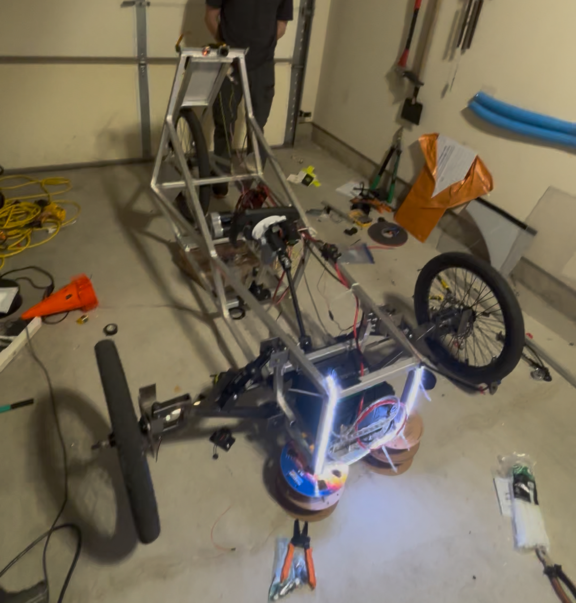
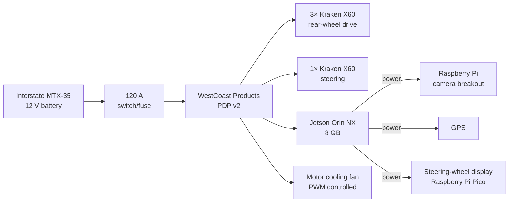
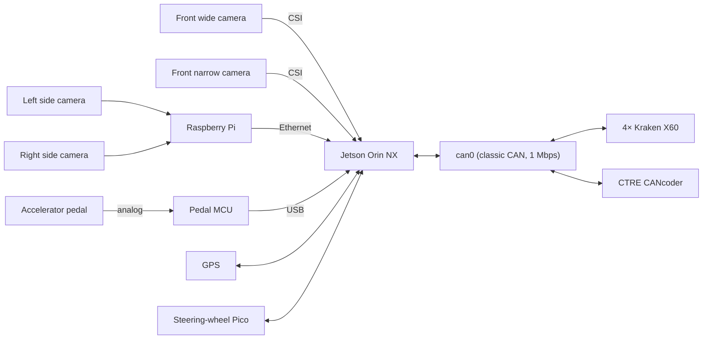
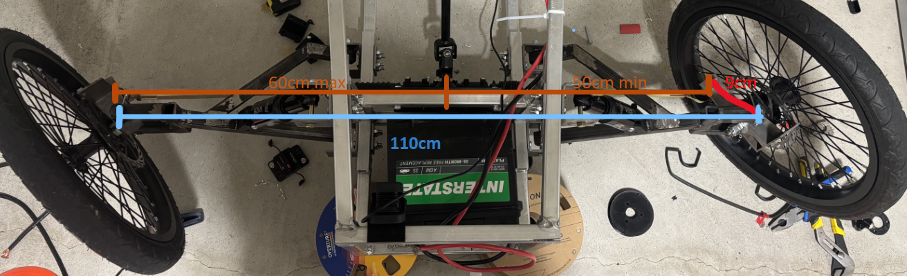
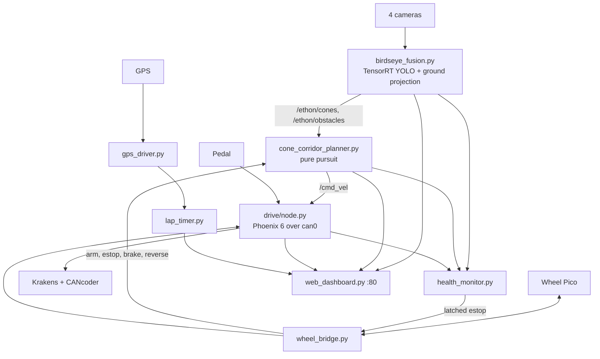

# Ethon

Ethon is a three-wheeled electric vehicle (Team 1360 Electrathon) with an
autonomy stack running on an NVIDIA Jetson Orin NX. This repository holds the
vehicle hardware reference, a backup of the firmware deployed on the Jetson,
and the self-driving v1 data-capture and review tooling.



*Current vehicle build.*

> [!WARNING]
> This software controls a vehicle that carries a person. Verify wiring,
> actuator limits, steering zero/sign, and sensor calibration on the car before
> commanding motion. Bench-test with the wheels off the ground and someone at
> the physical emergency stop.

## At a glance

| | |
|---|---|
| Layout | One driven 26 in rear wheel, two steered 20 in front wheels |
| Wheelbase / kingpin span | 152 cm / 110 cm |
| Compute | NVIDIA Jetson Orin NX 8 GB (L4T R36.4.7, ROS 2 Humble) |
| Propulsion | 3× Kraken X60 → rear wheel, 11.46:1 (12:60 × 24:55) |
| Steering | 1× Kraken X60, 1:5, CTRE CANcoder on the shaft |
| Power | Interstate MTX-35 12 V → 120 A switch/fuse → WCP PDP v2 |
| Cameras | 2 front CSI (narrow + fisheye wide), 2 side Pi Camera 3 Wide via a Raspberry Pi |
| CAD | [Onshape vehicle model](https://cad.onshape.com/documents/52e6baf654a7eb8018ef5191/w/2c72d87a029869f997f04ff6/e/ecf9453e586affb1903a958c?renderMode=0&uiState=6a8508e0161e1c59dbad16f5) |

## Hardware

### Power distribution



### Data and control connections



### Steering geometry



*Front steering linkage viewed from above, with its key dimensions labelled.*

The steering shaft (about ±175° mechanical travel — **not** wheel angle) drives
a 20 cm rigid central link offset 5 cm from the kingpin line. The link translates
±5 cm laterally and pushes 9 cm steering arms through rigid side links, which
produces different inner and outer wheel angles. Full dimensions and the
Ackermann sketch are in [CAR.md](CAR.md#steering-geometry).

## Software



Most nodes are plain Python scripts under `/home/jetson/ethon`, run by systemd
units (`ethon-stack`, `ethon-drive`, `ethon-wheel`, `ethon-gps`, `ethon-lap`,
`ethon-race`, `ethon-dashboard`). Safety relies on several independent
fail-silent gates: the planner starts disarmed, stale perception or `/cmd_vel`
zeroes the motors, Phoenix disables on a lost enable feed, and the estop latches
until a deliberate clear. See [FIRMWARE.md](FIRMWARE.md) for the full service
list, ROS topics, configuration values, and known drift between docs and the
deployed system.

### Self-driving v1

v1 aims to steer around a fixed, empty track at low speed using a small
imitation-learning policy (ResNet-18 + GRU + curvature trajectory head). The
Jetson records the two front cameras as H.264 MP4 alongside synchronized
frame/CAN/GPS/event Parquet tables; a GP19 button on the steering wheel starts
and stops recording. A local viewer replays both videos on one timeline with
telemetry traces and run-health warnings.

## Repository layout

```text
.
├── CAR.md                      Vehicle hardware reference
├── FIRMWARE.md                 Deployed Jetson software and autonomy stack
├── docs/images/                Photos and diagrams used by the docs
├── jetson/ethon/               Backup of /home/jetson/ethon on the Jetson
│   ├── drive/                  Modular drivetrain and steering package
│   ├── v1_capture/             Synchronized MP4/Parquet recorder
│   ├── pico/                   Steering-wheel CircuitPython firmware
│   ├── calib/                  Camera homographies and calibration images
│   ├── deployed/               Snapshots of installed systemd/udev files
│   └── models/                 Model manifest (binaries stay on the Jetson)
├── selfdriving/v1/             v1 dataset design, operator guide, run viewer
└── wheel_angle_gui.ps1         Windows GUI showing live steering angle from the Jetson
```

Files named `*.bak*` and everything in `jetson/ethon/legacy/` are historical
snapshots, not active entry points. Captures, logs, and model binaries stay on
the Jetson and are ignored by Git.

## Documentation index

| Document | Covers |
|---|---|
| [CAR.md](CAR.md) | Physical vehicle, wiring, drivetrain, steering geometry |
| [FIRMWARE.md](FIRMWARE.md) | Runtime platform, services, ROS interfaces, safety, deployment workflow |
| [selfdriving/v1/DATACAPTURE.md](selfdriving/v1/DATACAPTURE.md) | v1 model choice and dataset contract |
| [selfdriving/v1/README.md](selfdriving/v1/README.md) | Operator guide for starting, stopping, and checking captures |
| [selfdriving/v1/viewer/README.md](selfdriving/v1/viewer/README.md) | Local synchronized run viewer |
| [jetson/ethon/v1_capture/README.md](jetson/ethon/v1_capture/README.md) | Recorder implementation details |
| [jetson/ethon/CALIBRATION.md](jetson/ethon/CALIBRATION.md) | Ground-plane camera calibration runbook |
| [jetson/ethon/RUNBOOK.md](jetson/ethon/RUNBOOK.md) | Operator runbook (partly historical) |
| [jetson/ethon/PROJECT_HANDOFF.md](jetson/ethon/PROJECT_HANDOFF.md) | Project history and handoff notes (partly historical) |
| [jetson/ethon/PLANNER_SAFETY_PROPOSAL.md](jetson/ethon/PLANNER_SAFETY_PROPOSAL.md) | Proposed planner hazard-reaction changes |

## Working on the vehicle

1. Edit and review changes under `jetson/ethon/` here; this repo is the source of
   truth, not the live Jetson directory.
2. Deploy only the intended files to `/home/jetson/ethon`; never copy `.bak`
   files over active paths.
3. Keep the classic-CAN override in `deployed/systemd/ethon-can.service.d/`
   unless every CAN device is deliberately moved to CAN-FD.
4. Run read-only preflight checks first, and treat anything that can arm, steer,
   or spin a motor as a separate, prepared hardware test.
